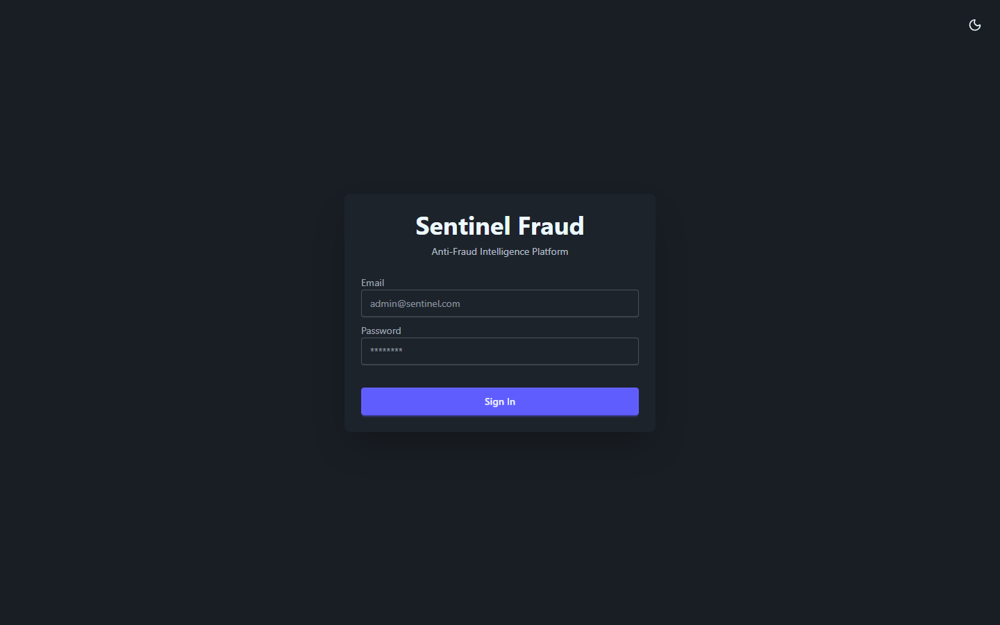
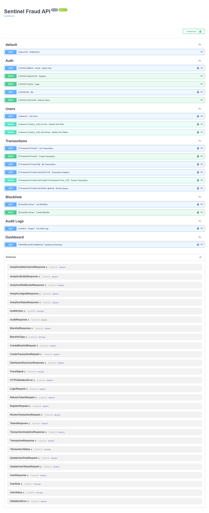
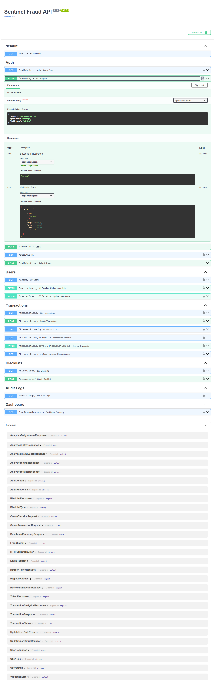
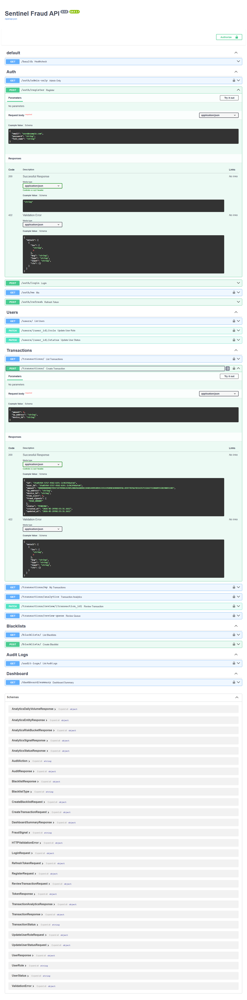
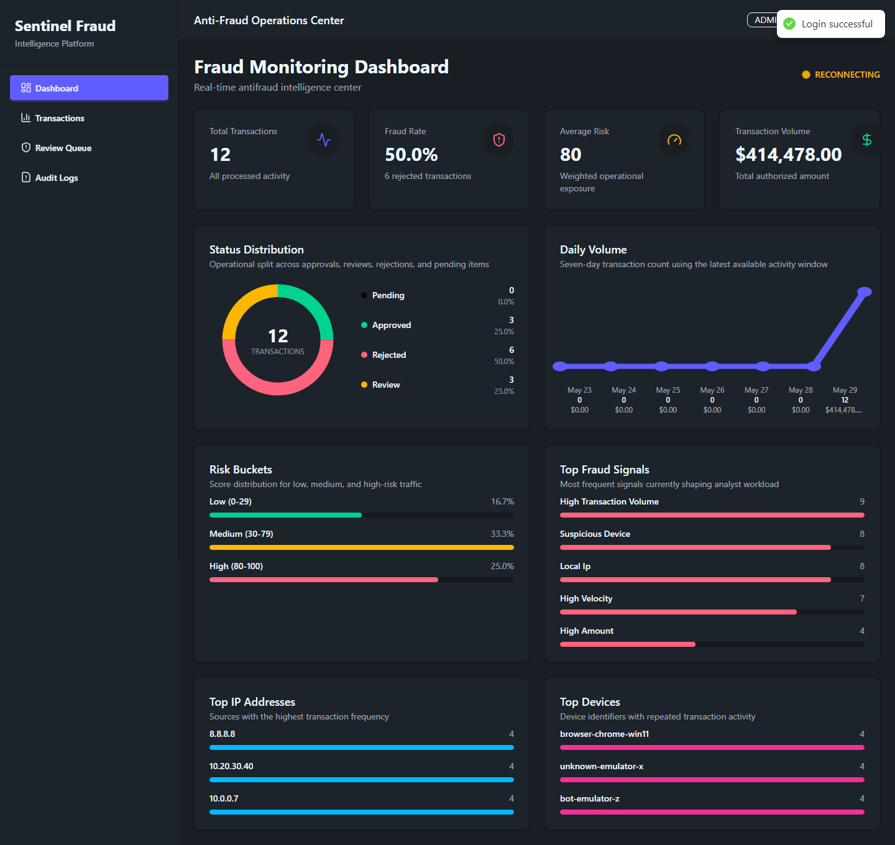
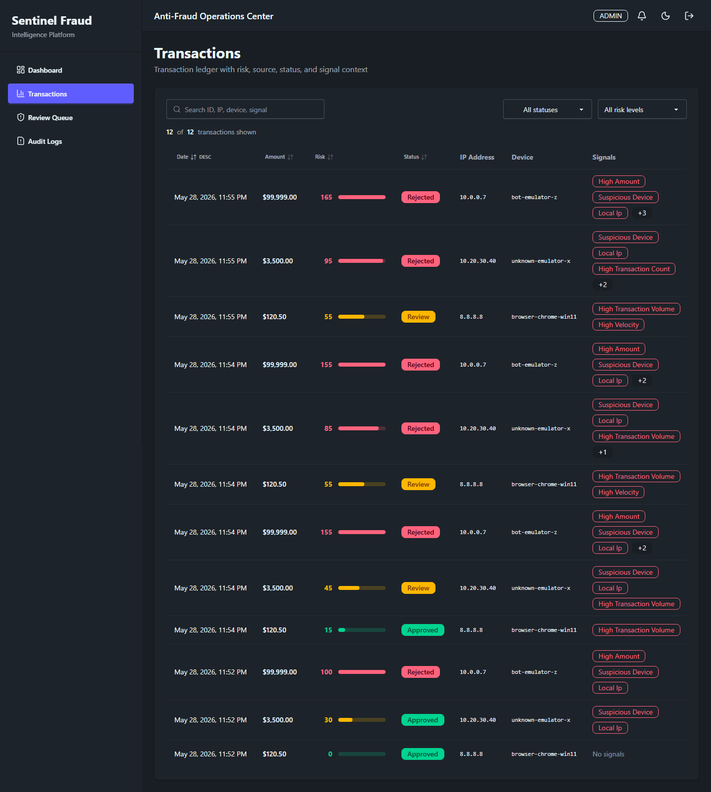
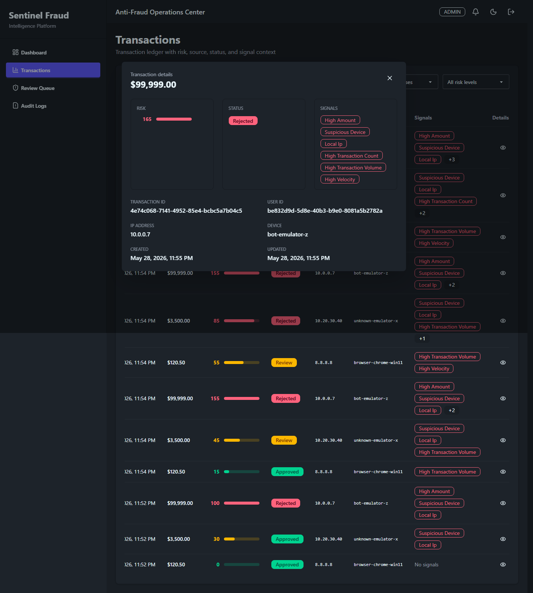
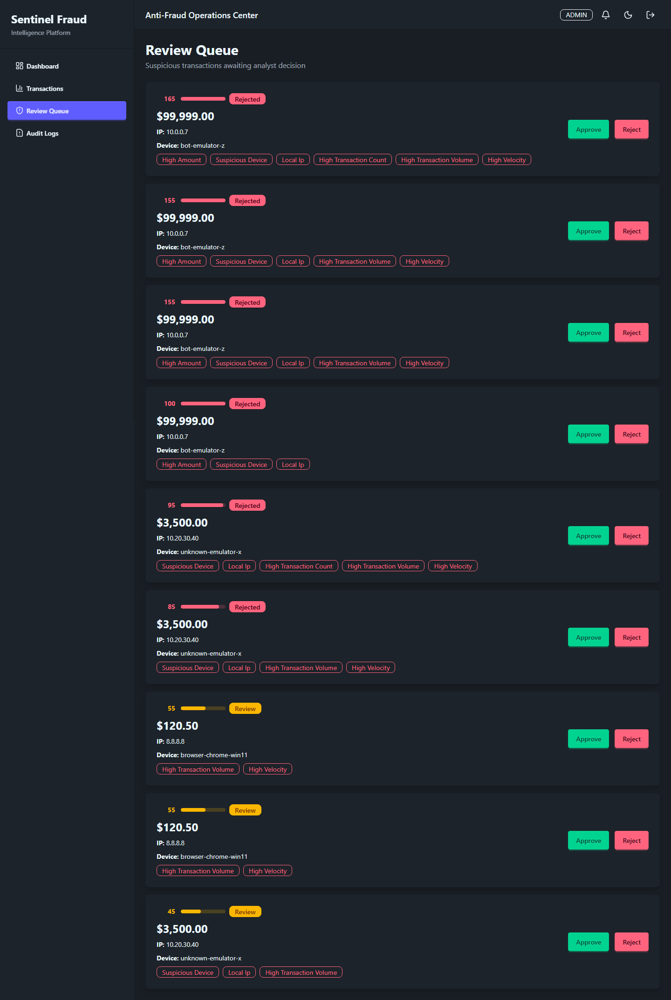
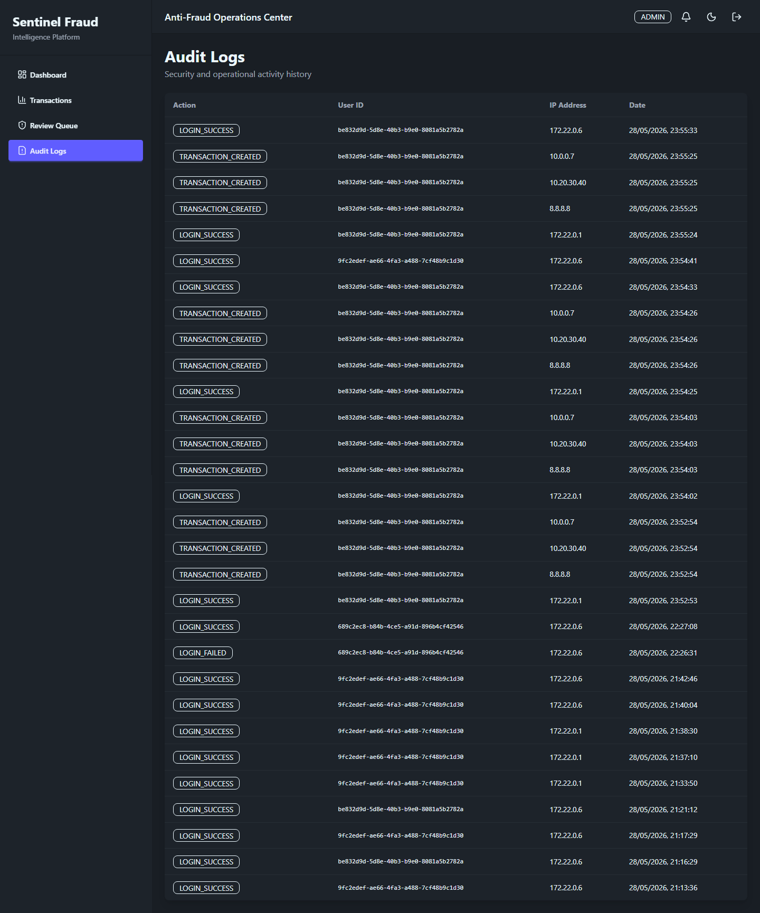
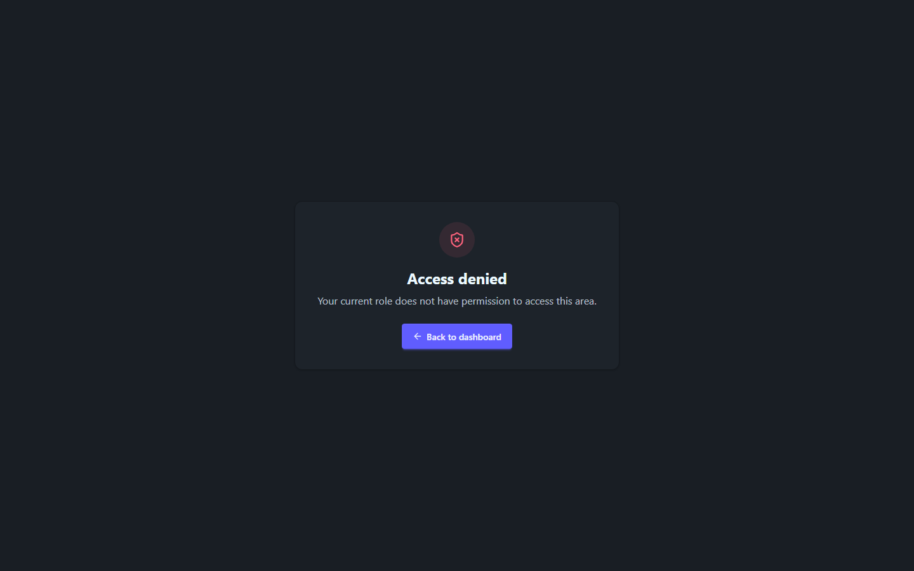

# Guia E2E de Operacao

Este guia cobre o fluxo completo da aplicacao em ambiente local: registro de usuario, autenticacao, entrada de transacoes via API e validacao operacional no frontend.

## 1) Subir ambiente

No PowerShell:

```powershell
.\infra\demo\start-public-demo.ps1
```

Esse comando sobe API/Web/DB, aplica migracoes e deixa as contas demo prontas.

## 2) Login no frontend

Acesse `http://localhost:8080` e autentique com uma conta demo.



## 3) API interativa (Swagger)

Abra `http://localhost:8000/docs`.



### Registro de usuario

Use `POST /auth/register` para cadastrar um novo operador.

Payload sugerido:

```json
{
  "email": "operador.teste@sentinel-demo.com",
  "password": "SenhaForte@2026",
  "full_name": "Operador Teste"
}
```



### Criacao de transacao

Use `POST /transactions/` com token JWT para simular entrada operacional.

Payload sugerido:

```json
{
  "amount": 3500,
  "ip_address": "10.20.30.40",
  "device_id": "unknown-emulator-x"
}
```



## 4) Dashboard operacional

Depois do login (ADMIN/ANALYST/OPERATOR), valide KPIs e status do ambiente.



## 5) Tabela de transacoes

Em `Transactions`, valide filtro, risco, status e trilha por item.



### Detalhes de transacao

Abra uma linha para inspecionar sinais de fraude e contexto da operacao.



## 6) Fila de revisao

Em `Review Queue`, analise transacoes suspeitas e execute decisao manual (`Approve`/`Reject`).



## 7) Auditoria

Em `Audit Logs`, confira eventos criticos (login, criacao e revisao de transacoes).



## 8) Validacao de RBAC

Com perfil `OPERATOR`, acesse uma rota restrita para validar bloqueio de permissao.



## 9) Credenciais demo

Senha unica:

- `SentinelDemo@2026`

Contas:

- `demo.admin@sentinel-demo.com` (`ADMIN`)
- `demo.analyst@sentinel-demo.com` (`ANALYST`)
- `demo.operator@sentinel-demo.com` (`OPERATOR`)
